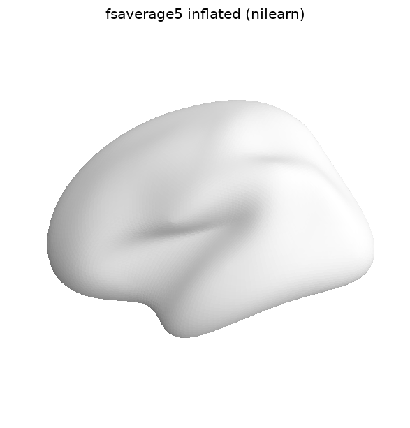
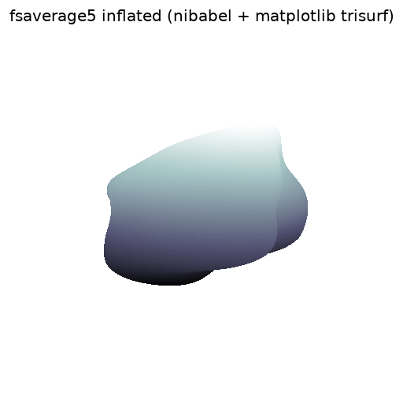
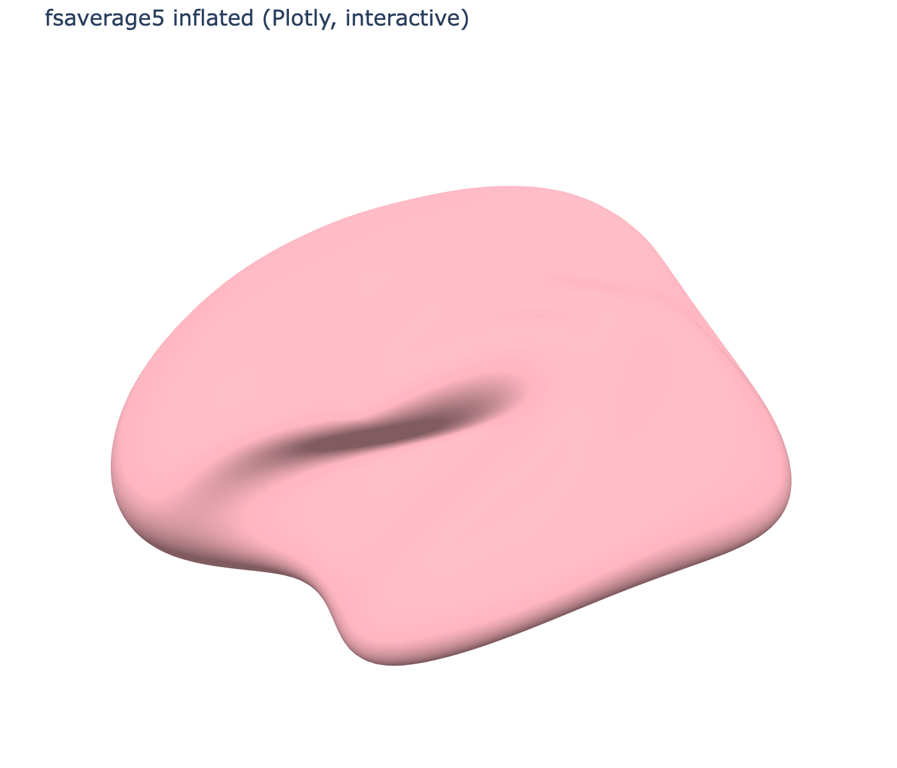

# surface_visualization

A lightweight showcase of how to **load and visualize a canonical inflated
cortical surface** across the major neuroimaging tooling ecosystems.

Every example operates on the *same* asset: the **`fsaverage5` inflated
surface** (~10,242 vertices / hemisphere), fetched once by
[`00_fetch_surface.py`](00_fetch_surface.py) via
[nilearn](https://nilearn.github.io/). nilearn hands back a standard-format
GIFTI file, so the Python, FreeSurfer, and MATLAB examples can all point at the
same canonical geometry.

There is **no test suite** — this is a comparative reference, not a library.

## Layout

| File | Tool | Status |
|------|------|--------|
| [`00_fetch_surface.py`](00_fetch_surface.py) | nilearn fetch → `data/` | ✅ runnable |
| [`01_nilearn.py`](01_nilearn.py)   | nilearn `plot_surf` | ✅ runnable |
| [`02_nibabel.py`](02_nibabel.py)   | nibabel (GIFTI + FreeSurfer geometry) | ✅ runnable |
| [`03_plotly.py`](03_plotly.py)     | Plotly interactive 3D mesh | ✅ runnable |
| [`04_pysurfer.md`](04_pysurfer.md) | PySurfer / Mayavi | 📄 documented |
| [`05_freesurfer.md`](05_freesurfer.md) | FreeSurfer CLI (`freeview`, `mris_convert`) | 📄 documented |
| [`06_matlab.md`](06_matlab.md)     | MATLAB (`read_surf.m`, SPM `gifti`) | 📄 documented |

The runnable Python examples render headless (no display required). The
documented examples are copy-paste snippets for environments that aren't assumed
installed here (Mayavi, FreeSurfer, MATLAB).

## Quickstart

```bash
python -m venv .venv && source .venv/bin/activate
pip install -r requirements.txt

python 00_fetch_surface.py   # fetch the canonical surface into data/
python 01_nilearn.py         # -> outputs/01_nilearn.png
python 02_nibabel.py         # -> outputs/02_nibabel.png
python 03_plotly.py          # -> outputs/03_plotly.html (+ .png)
```

## Rendered output

All three runnable scripts render the **same** inflated left hemisphere
(lateral view), each with its library's native plotting:

| nilearn | nibabel + matplotlib | Plotly |
|---------|----------------------|--------|
|  |  |  |

`03_plotly.py` also writes [`outputs/03_plotly.html`](outputs/03_plotly.html) —
open it in a browser to rotate and zoom the mesh interactively.

## How each tool loads the surface

- **nilearn** — highest level: `load_fsaverage()` returns a `PolyMesh`; pass it
  straight to `plot_surf` / `view_surf`. No file paths needed.
- **nibabel** — lowest level: `nib.load(...).agg_data(...)` for GIFTI, or
  `nib.freesurfer.read_geometry(...)` for FreeSurfer binary geometry. Both
  return `(coords, faces)` NumPy arrays — the foundation everything else builds
  on.
- **Plotly** — feed `coords`/`faces` into `go.Mesh3d` for a dependency-light
  interactive 3D view that runs anywhere.
- **PySurfer / FreeSurfer / MATLAB** — see the respective `.md` files.

## Requirements

See [`requirements.txt`](requirements.txt): `nilearn`, `nibabel`, `plotly`,
`matplotlib`, `kaleido` (for static Plotly PNG export). Verified on Python 3.14.
